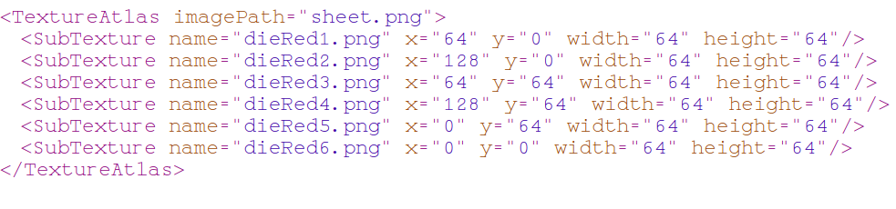

# Iffy
<p align="justify">
Iffy is basically a helper library which makes working with spritesheets and tilesets a *hell lot* easier. Load sprite data from XML or CSV files and render sprites just like you'd render images. If that's not all you can also add sprite data (like you'd with other libraries) and if you want you could export the sprite-data (that you created) to XML,CSV files so that you could load from that later (or some external program might load from that). Oh and yes - Iffy can also help you with tilemaps that were exported by Tiled. Not just Tiled but also with tilemaps in the form of Lua tables. Iffy could also help you with loading Tilesets. Have a weird margin problem in the tileset? Don't worry Iffy will fix that for you. Want to render a tilemap for a specific tileset? Iffy does that as well.
</p>

> Note that Iffy helps only with static images - and by that I mean Iffy can't help you with animations and also it can't help you with AutoTiles. Now if you are disappointed by hearing that and feel like closing this tab, head over to [A quick walkthrough](#a-quick-walkthrough) for the motivation you need

# Table of Contents

- [A quick walkthrough](#a-quick-walkthrough)
- [Documentaion](#documentation)
	- [How Iffy works?](#how-iffy-works)
	- [A quick glance at all the functions](#a-quick-glance-at-all-the-functions)
	- [Creating a SpriteSheet using a Metafile](#Creating-a-SpriteSheet-using-Metafile)
		- [newAtlas](#newAtlas)
	- [Creating a SpriteSheet without any Metafile](#Creating-a-SpriteSheet-without-any-metafile)
		- [newImage](#newImage)
		- [newSprite](#newSprite)
	- [Drawing a Sprite (or a Tile)](#Drawing-a-Spriteor-a-Tile)
		- [draw](#draw)
		- [drawSprite](#drawSprite)
	- [Miscellaneous Operations on Sprites](#Miscellaneous-Operations-on-Sprites)
		- [get](#get)
		- [getSprite](#getSprite)
		- [duplicateSprite](#duplicateSprite)
	- [Iffy and the world of Tiles](#iffy-and-the-world-of-tiles)
		- [newTileset](#newTileset)
		- [newTilemap](#newTilemap)
		- [drawTilemap](#drawTilemap)
- [Metafile format used by Iffy](#metafile-format-used-by-iffy)
- [Aliases used by Iffy](#aliases-used-by-iffy)
- [Feedback?](#feedback)

## How to use Iffy?

Since it's a module you need to require it

```lua
	iffy = require 'iffy'
```

If iffy is not in the same folder as main.lua then you'd say something like `require 'pathto/iffy'`.

# A Quick Walkthrough

Have you ever used Kenney's assets? Then you may know that *all* of Kenney's assets are "game-ready". Meaning you don't have to tweak anything or do some extra work to load those assets. Every spritesheet of Kenney - unless it's a tileset or has animations in it - has an XML file by the same name. Now let's not talk much. Let me give you context. Here's a spritesheet made by Kenney (on left is the image 'diceRed.png' and on right is the metafile 'diceRed.xml')

<p align="center"></p>

That's so nice of Kenney that he provided us with an XML file containing all the information about the individual sprites : but how do we use it - in LOVE2D. That's where Iffy comes to the rescue. With Iffy you'd do something like this:-

```lua
iffy.newAtlas("diceRed.png")
```

And *that's it*!! Now if you want to draw an individual sprite you'd do something like this

```lua
iffy.drawSprite('diceRed6.png')
```

Ofcourse you could provide additional parameters for x,y,r,sx,sy,etc. But we set all to default for making this example simple. Now note here that `diceRed6.png` comes from the XML file. To remove the '.png' - if you want to - you could easily replace all instances of '.png' with '' in the XML file.

Second to XML, there's a very popular format for storing sprite data - CSV!! What if your sprite data was not stored in XML but in CSV. Don't worry- Iffy does that as well. Let's say you have two files "dice.png" and "dice.csv" like this:-

<p align="center"></p>

So just like before - infact exactly the same as before (BTW Don't worry about the extra data. Iffy will ignore them) The way you would load and draw a sprite is :-

```lua
iffy.newAtlas("dice.png")

function love.draw()
	iffy.drawSprite('dice4')
end
```

# Documentation
Ah!! It was just yesterday that I wrote this library in my spare time and here I'm - writing its documentation. Anyways let's get started already- let's first start by seeing how Iffy works and then take a quick glance at all of iffy's functions

## How Iffy works?

Before we move on to overloads of the functions. Let me - very briefly, and on a high-level - state how iffy works. Iffy keeps a database of sprites each mapped to the atlas they were captured from. Both the sprites and images have a name so they could be identified. While the image names must be unique the sprite-names do not have to be unique unless they belong to the same atlas. While you could access a sprite without specifying which atlas it belongs to (using functions like [`getSprite`](#getSprite), [`drawSprite`](#drawSprite), etc) - it's recommended that you be more precise and use functions like [`get`](#get) and [`draw`](#draw) instead of their counterparts - if you have sprite-names by the same name mapped to different atlas. For more info in this matter head over [here](#drawSprite)

> Just as a side-note to speed up accessing sprites, Iffy also maintains cache.

Iffy also keeps a database of the sprite-data - if you are manually ripping out sprites from their atlases using Iffy's [`newSprite`](#newSprite). This is so that this data could be exported later - if you want to - using [`exportCSV`](#exportCSV) or [`exportXML`](#exportXML).

Enough talk about spritesheets, let's move over to tilesets and tilemaps. Even though Iffy treats a tile just like a sprite, Iffy has a dedicated database for the tilesets that were created - mainly to get the *tilewidth* and *tileheight* so that it could render the tilemaps (for these tilesets) correctly.

> And as a quick note here - In Iffy tiles are accessed by numbers whereas sprites are accessed by their names. 

Now loading and rendering tilemaps are - unlike the dedicated libraries - very easy in Iffy. This however doesn't mean Iffy is a replacement for ATL or STL. Iffy doesn't have any feature for AutoTiles and Iffy can only load CSV format tilemaps (ones exported by Tiled) or load tilemaps from a lua table and then to render them you need to pass the tilemap name and the tileset name. 

> The above is not the same as saying that Iffy isn't good with tilesets. As long as you don't want auto-tiles and go fancy with it - Iffy can help you a lot with tilemaps. First of all it helps keeps data and code seperate in that the maps are in the CSV format and not in Lua format. You can very easily have layers using Iffy - just have more than one tilemaps and render them accordingly. (The down-side is that then that'd be "two or more tilemaps" meaning more than one file to render a single map)

And if I didn't say this earlier then: Iffy also maintains a database of the tilemaps that were loaded via a CSV file or a lua table. And I don't think I said this in the beginning but Iffy also maintains a database of all the images that were loaded either from file or passed as argument and the image names - if i didn't say this earlier - are mapped to each of these images so that when rendering Iffy'd know which image to render just from a string passed in as argument. Now it may look like Iffy wastes a lot of memory but it doesn't. Most of the data-base entries are references of one-another. Even Iffy's cache stores only references of the already created objects and not a seperate object of its own.

## A quick glance at all the functions

   Function                  |  Overloads       |  Description
-----------------------------|------------------|---------------
  [newSprite](#newSprite)    |<center>3</center>| Makes a brand new sprite from the                                                    given parameters and returns the                                                     quad that was created
  [newImage](#newImage)      |<center>3</center>| Adds the given image to the Iffy's                                                   database
  [newAtlas](#newAtlas)      |<center>3</center>| Makes a brand new spritesheet from                                                   the provided image and metafile and                                                  returns a reference to the htable of                                                 image-quads that were created
  [newTileset](#newTileset)  |<center>3</center>| Makes a brand new tileset from the                                                   given parameters
  [newTilemap](#newTileset)  |<center>3</center>| Loads a tilemap from a CSV file or a                                                 table in the same format
  [drawTilemap](#drawTilemap)|<center>1</center>| Draws a given tilemap for a given                                                    tileset
  [getImage](#getImage)      |<center>1</center>| Gets a reference of the image from                                                   Iffy's database
  [getSprite](#getSprite)    |<center>1</center>| Gets a reference of the sprite and                                                   the atlas it belongs to from Iffy's                                                  database
  [duplicateSprite](#duplicateSprite)|<center>1</center>| Make aliases for a sprite                                                            name
  [get](#get)                |<center>1</center>| Gets a reference of the sprite *from                                                 a particular atlas* from Iffy's                                                      database
  [drawSprite](#drawSprite)  |<center>1</center>| Draws a sprite without asking the                                                    end-user to specify- for which atlas?
  [draw](#draw)              |<center>1</center>| Draws a sprite from a given atlas
  [exportCSV](#exportCSV)    |<center>1</center>| Exports the sprite-data to a CSV file
  [exportXML](#exportXML)    |<center>1</center>| Exports the sprite-data to a XML file

## Creating a SpriteSheet using Metafile

In this section we will look at how one can create a spritesheet (create all the quads for further use) using an external metafile (some XML or CSV)

### newAtlas

So `newAtlas` - the function which we looked at in our [quick walkthrough](#a-quick-walkthrough). But we didn't discuss the overloads there and maybe you didn't completely understand what it does - within the hood - for you, even after reading the description.

So what newAtlas does is - it loads all the data from the meta-file provided for the image and creates the quads based on that. Since each quad needs to identified later on it also needs an *image name* to namespace a sprite-name within that name. (BTW the sprite-name is present in the metafile) If you want you can also scale the object by providing extra `sw,sh` parameters. 

Now there are 4 overloads to newAtlas. Let's look at the most descriptive one first :-


```html
<table> newAtlas(<string> name, <string> img_url, <string> metafile, [<number> sw,<number> sh])     --Overload #1
<table> newAtlas(<string> name, <userdata>   img, <string> metafile, [<number> sw,<number> sh])     --Overload #2
```

1. So the first parameter is the name which is the name of the image. I want to stress this over and over again that Iffy has its own database. It doesn't depend on you to pass the image during rendering a sprite. Rather it keeps a reference to the image which it accesses by an key and this key is decided by you!

2. So anyways the second parameter is either the *url* of the image (overload #1) (in case you haven't loaded the image on your own) or the *reference* to the image (overload #2).

3. The third parameter is the url of the metafile - the XML or the CSV file which has the data concerning the sprite's name, dimensions and position in the atlas. To understand the format in which data should go I suggest you look at the reference images- <a href="Images/wtxml.png">for xml</a> and <a href="Images/dicecsv.png">for csv</a>. We anyways'll talk about the format in [this](#metafile-format) section.

4. And the fourth and fifth parameter - like I said in the beginning - are the image dimensions which are by default the image dimensions.

<br/>

> *But it was so simple in the walkthrough?* - You might say. In a moment we'll find out it still is!

Here comes Overload #3 :

```html
<table> newAtlas(<string> img_url, [<string> metafile])     --Overload #3
```

So in the third overload we only pass the *url* of the image and the url of the metafile. As you may know `sw,sh` are defaulted to the image's dimensions and the image name - `name` is defaulted to the filename of the image. For eg. for url 'assets\hello.png' the image name will be 'hello'.

It is interesting to note that `metafile` is within square brackets. So you can only pass the image url and it'd still work. It would find the name automatically like it did earlier and it'll be assumed that the `metafile` is in the same location as the image and has the same filename except for the extension (no extension,".xml",".csv" or ".txt" supported).
</p>
<br/>

> Now I'd like to point out here that even though `newAtlas` returns a table yet it's not mandatory for you to store it. Especially not if you are going to use Iffy's functions to render the sprites.

## Creating a SpriteSheet without any metafile

In this section will look at how you can create a spritesheet like you - most likely - had been before you bumped into Iffy (assuming you'd use Iffy from now on). So you create each sprite individually. But even then the *iffiness* would still be there. How? Well you'll find out on your own

### newImage

When creating a spritesheet using [`newAtlas`](#newAtlas) or [`newTileset`](#newTileset) the image is loaded onto Iffy's database automatically. But if you want to load an image manually - maybe to use [`newSprite`](#newSprite) - you can always use `newImage`

```html
<nil> newImage(<string> img_name, <string> img_url)                                              --Overload #1
<nil> newImage(<string> img_name, <userdata> img)                                                --Overload #2
<nil> newImage(<string> img_url)                                                                 --Overload #3
```

So you pass in the name of the image and the url or the reference of the image and Iffy would do its thing. If the name of the image is the same as the image's filename then you only pass the url of the image

### newSprite

Sometimes you may not have a metafile and actually that counts as "*most of the time*"! And most of the libraries are aligned towards that situation. So how could Iffy leave behind!

```html
<userdata> newSprite(<string> img_name, spr_name, <number> x, y, width, height, <userdata> img)  --Overload #1
<userdata> newSprite(<string> img_name, spr_name, <number> x, y, width, height, sw, sh)          --Overload #2
<userdata> newSprite(<string> img_name, spr_name, <number> x, y, width, height)                  --Overload #3
```

I think some of it is trivial - you pass in the name of the image and the sprite-data i.e. the name,position and dimensions of the sprite and then finally the dimensions of the image. You can either pass the image itself (Overload #1) and Iffy would do its thing or you could pass in the dimensions of the image manually (Overload #2). If however the image was loaded before using [`newImage`](#newImage) then you don't need to provide either of those (Overload #3)
It'd return a Quad.

> Note that `newSprite` doesn't load an image (even if you used Overload #1). You must load the image (by the name you used in `newSprite`) And by loading an image I mean loading an image onto Iffy's database which you would normally do using [`newImage`](#newImage). It doesn't matter in which order you load the image and create the sprite - the whole thing is about loading the image before rendering the sprite.

## Exporting your SpriteData

Now that you have created the sprites manually you may want to export them to some generic format. Maybe to want to use them later with [`newAtlas`](#newAtlas) or whatever may be the reason. Iffy supports two formats - XML and CSV both of which are wildly used in the sprite world. 

> Note here that all of this is relevant only for spritesheets. I can't imagine the situation where you would want to export tileset data (that'd be kinda lame though). Also note that if you try to export a file which is already present then Iffy will warn you that that file already exists (that doesn't mean it wont' overwrite it - it will just let you know)

### exportXML

```html
<nil> exportXML(<string> img_name, [<string> path, <string> filename])
```

The `img_name` is the name of the image, `path` is the path where you want to store the metafile and `filename` is the name of the metafile.

Note that the path is defaulted to "" and the filename is defaulted to the image name plus ".xml"

### exportCSV

```html
<nil> exportCSV(<string> img_name, [<string> path, <string> filename])
```
Everything is exactly the same as [`exportXML`](#exportXML) just the filename is defaulted to the image name plus ".csv" (instead of ".xml")

## Drawing a Sprite (or a Tile)

Everything's great so far. But how do you draw stuff? Since the image quads are returned in every init functions you could use `love.draw` but really it won't look good. So Iffy has it's own draw functions - one generic (`draw`) and one specific (`drawSprite`) So let's take a quick look at both of them

### draw

```html
<nil> draw(<string> img_name,<string> sprite_name, ...)
```

I won't type in too many lines for this function. You pass in the image name and the sprite name (or the tile no if you are using tileset) and then the regular parameters for position,rotation,etc in the ...

### drawSprite

```html
<nil> drawSprite(<string> sprite_name, ...)
```

Unlike [`draw`](#draw), `drawSprite` doesn't need an image name - it'll automatically find the image name which has a sprite by the given name. And once found it'd store it to cache for further use and easy retrieval. The ... holds the regular paramters like position,rotation,etc. BTW even though you could technically but it's not recommended that you draw a tile using `drawSprite`. To be precise drawSprite as the name suggests was always meant only for drawing sprites. So it's recommended you don't draw a tile with it. Use [`draw`](#draw) instead (if you *have to* draw a single tile)

## Miscellaneous Operations on Sprites

### get

```html
<userdata> get(<string> img_name,<string> sprite_name)
```

If you don't plan to use [`draw`](#draw) then you may want to use `get` which simply returnss the Quad.

### getSprite

```html
<userdata,userdata> getSprite(<string> sprite_name)
```

Unlike [`get`](#get), `getSprite` doesn't need an image name - it'll automatically find the image name which has a sprite by the given name. However `getSprite` returns two userdata - *Drawable* (the alleged image that was found) and *Quad* (the actual sprite)

> Just as a side note here - `getSprite` is used internally by [`drawSprite`](#drawSprite)

### duplicateSprite

```html
<nil> duplicateSprite(<string> img_name, <string> orig_sprite_name, <string> alias_sprite_name)
```

What if you want more than one spritename perhaps for your own ease! `duplicateSprite` will basically make an alias of the sprite so that you could access the same Quad with more than one name.

## Iffy and the world of Tiles

### newTileset

Second to [`newAtlas`](#newAtlas) there's another function which helps you in making a spritesheet very quickly - which is `newTileset`. Now a tileset is not the same as a spritesheet. Iffy treats both of them differently - a sprite is keyed by a unique name (in the atlas) but a tile is is indexed by a number starting from top to bottom and left to right from 1.

There are 3 main overloads which I'm just gonna wave my hand over:-

```html
<table> newTileset(<string> tset_name, <string> img_url, <number> [tw, th, mx, my, sw, sh] )     --Overload #1
<table> newTileset(<string> tset_name, <userdata>   img, <number> [tw, th, mx, my, sw, sh] )     --Overload #2
<table> newTileset(<string> img_url)                                                             --Overload #3
```

Now just like spritesheet, tilesets too have names to identify them later. And of-course the tileset image need to be passed either as url or as reference. (#1 and #2). But what are these other parameters?

`tw,th` are the tile-widths and tile-heights, the are 32,32 by default. `mx,my` are the margin/spacing\* between the tiles. (Note that the first tile must be at (0,0) in the tileset) and the last parameters `sw,sh` are the atlas dimensions which are by default the same as the image's dimensions

> The terms margin and spacing are not interchangeable but Kenney uses them interchangeably so I'm just following on his footsteps

### newTilemap

```html
<table> newTilemap(<string> tmap_name, <string> map_url)                                         --Overload #1
<nil>   newTilemap(<string> tmap_name, <table>  map)                                             --Overload #2
<table> newTilemap(<string> map_url)                                                             --Overload #3
```

Just like tilesets and spritesheets, tilemaps too have names. So you pass that and the `map_url` which is the path to the CSV file exported by Tiled (btw you can even handcraft the file). And then a table is returned which is the tilemap that was the loaded from the file.

But in case you already have a table then you may very well pass that so that Iffy would store a reference to it in its database. And note nothing is returned since it wouldn't make sense to return the same table that you passed in as argument.

The third overload however requires that you pass in the url of the map and then the tilemap name is calculated based on that (basically the filename minus the extension)

### drawTilemap

```html
<nil> drawTilemap(<string> map_name, <string> tileset_name, <number> [offset, mx, my])
```

To draw a tileset ofcourse you need to pass in the map name and then the tileset name specifying which tileset you want to use (cause this information is not in the tilemap). The third parameter `offset` basically adds itself to every tile number (received from the tilemap). For context - Tiled starts indexing from 0 but the tilesets in Iffy are numbered from 1 (since we are programming in Lua) so that'd cause an *off-by-one error*. To prevent such errors you add an offset of 1 to each tile number. By default offset is set to 0

> Note that in Iffy, zero and negative numbers are void tiles meaning no tile exist at that position. However for Tiled, -1 is the void tile.

The last parameters `mx,my` are the margin (not the spacing, as it was the case in [`newTileset`](#newTileset) that we used the words interchangeably). Basically it says from where to draw the tileset. By default it is 0,0

# Metafile format used by Iffy

> Spoiler: If you simply want to use Kenney's assets then skip this section. The only relevant section for you is [A quick walkthrough](#A-quick-walkthrough)

So what is the format that Iffy expects your metafile to be in? Iffy supports CSV and XML files but even in that format data could be stored in millions of ways. So what is the format that Iffy supports? So I researched on my own and found that the most common way of storing sprite-data in these two formats are as follows

```xml
<!-->Ofcourse the tagnames could be different</!-->
<TextureAtlas imgPath="sheet.png">
	<SubTexture name="sprite_01" x="0" y="0" width="32" height="32"/>
</TextureAtlas>
```

This is the format that Kenny stores his atlases in. He uses some software to merge his images into a spritesheet. Please note that while it's not mandatory for the tagnames to be exact but it's mandatory that the tree-like structure is maintained and also currently Iffy doesn't support comments in XML (for the reason that they are *very rarely used*) so please remove the comments and even any blank newlines. I'll make it easy for you here are the rules for the XML format (for it to be suitable to be used with Iffy):-

- The first line must be a dummy line (shouldn't have any information about any sprite)
- No dummy lines after the first line
- Except the first and the last line every other line must be a crucial line (shouldn't have the required information about a sprite)
- The x,y,width and height must be attributes (in the same line) and not tags
- The attributes name must be the same
- The parentheses around the attribute values are *must*

That may seem like a lot of work but most software exports XML in that format - no blank lines and comments are rare. The one that should concern you is - *the software Kenney uses exports in this format!!*

And the second format- one for CSV files is :-

```csv
"sprite_name", x, y , width, height
```

Hopefully Iffy is not so strict with the CSV format. You can have blank lines, no parentheses surrounding the *first* attribute, as many surrounding white spaces as you want. Iffy will trim them for you. You can even have comments (one beginning with '#'). And as you saw in [the quick walkthrough](#a-quick-walkthrough) you can even have some extra data which Iffy will simply ignore. But there are some rules which you must comply with, these general rules are :-

- The sprite name may or may not be in parentheses (Iffy assumes that the sprite name won't have any parentheses so any parentheses will simply be ignored)
- Other attributes must not be in parentheses no matter what
- All the data must be in one line (btw that is the rule of CSV file format)

# Aliases used by Iffy

Here are the aliases used by Iffy:-

```lua
	iffy.newSpritesheet = iffy.newAtlas
	iffy.newSpriteSheet = iffy.newAtlas
	iffy.newTileMap     = iffy.newTilemap
	iffy.newTileSet     = iffy.newTileset
```

# Feedback?

Do you see yourself using this library? If no, why? What could be improved? You can drop all your constructive comments,etc under Issues and I'll look at them or you could even [mail](mailto:netroco@rediffmail.com) me. 
Oh and since this is GitHub you are free to fork it (make your changes,etc. Iffy along with all the other libraries under lovelib is licensed under GPLv3 which is more flexible than the MIT license. So you should take advantage of it and maybe sell the library to some n00b - just kidding :laugh:) you can make a PR if you feel like it and I can't guarantee but most of the time I'll accept the changes you made.

